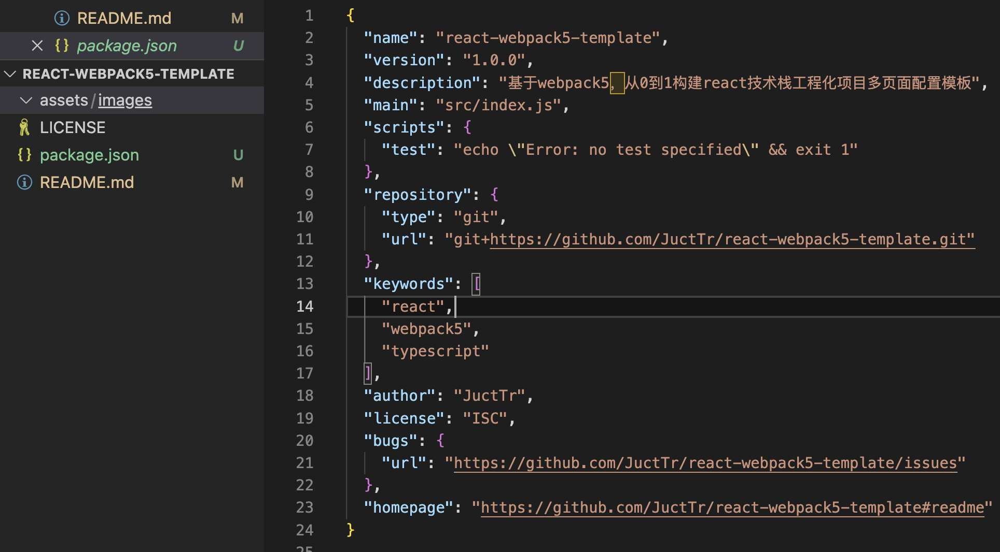
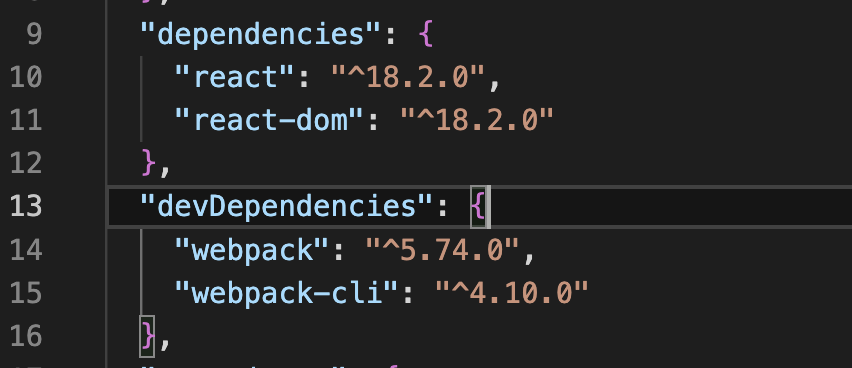
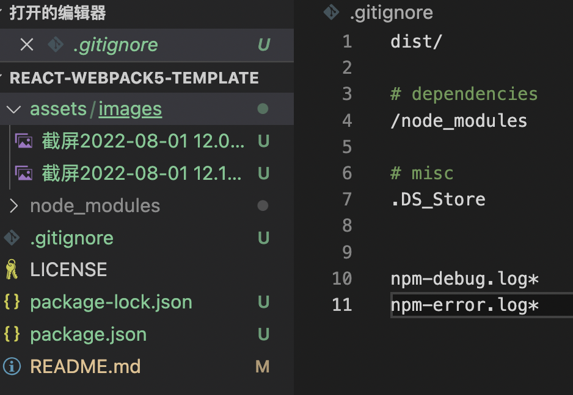

# react-webpack5-template
基于webpack5，从0到1构建react技术栈工程化项目多页面配置模板

# 初始化

```bash
npm init
```



## 安装相关依赖

### webpack

```bash
npm add -D webpack webpack-cli
```

### React

```bash
npm add react react-dom
```



### 新建.gitignore文件和图片目录


